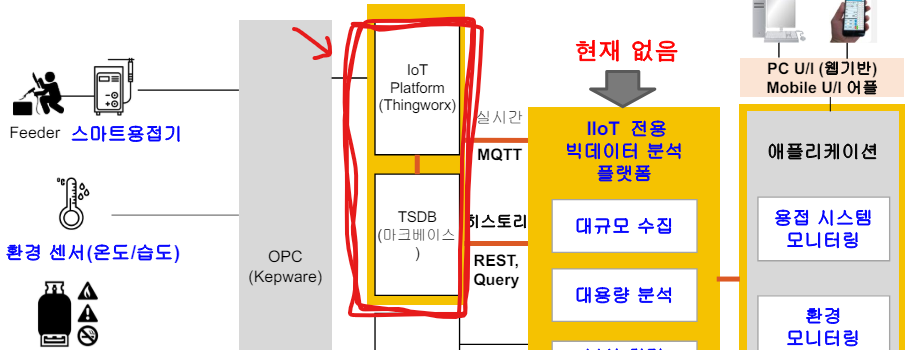
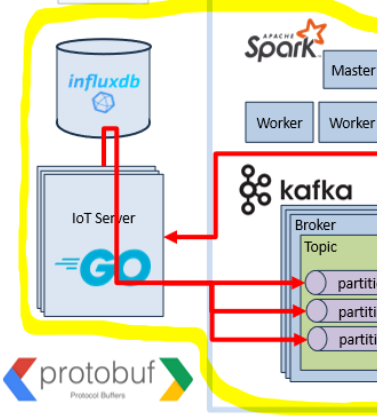
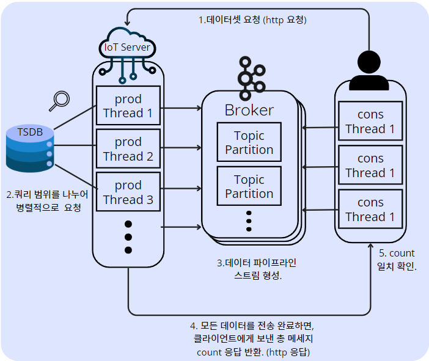

# large-dataset-delivery-kafka
대용량 데이터 전송을 위한 확장 가능한 IoT 데이터 처리 시스템.

IoT Platform 계층의 Iot server 모듈 역할을 담당.


## Background

H사의 IoT 플랫폼의 모듈을 참고하여 대용량 데이터 전송 서비스를 개선하고자 함
- 기존 REST API를 사용한 과거 데이터 조회 방식 

> 기존 IoT 플랫폼</br>



- 카프카를 이용한 데이터 전송

> 현재 아키텍쳐 중 해당 부분.</br>


> 대용량 데이터 전송 시나리오</br>



## Configuration File 
The application requires a `config.json`, `config.yaml` file that contains all necessary configurations. Below is a template of what this file should look like. Replace the example values with your actual configuration details.

### Server
> **go version** :  *go1.22.2 linux/amd64*
```
server/
├── config.go
├── config.json <--!!! MUST make this file.
├── dispatcher.go
├── examplepb
├── go.mod
├── go.sum
├── handlers.go
├── influx.go
├── jobs.go
├── main.go
├── utils.go
└── workers.go
```
Structure of `config.json`
```json
{
  "server": {
      "port": ":3001"
  },
  "kafka": {
    "bootstrapServers": "<ip_address1>:<port1>,<ip_address2>:<port2>,<ip_address3>:<port3>",
    "acks": "all",
    "enableIdempotence": "true",
    "compressionType": "lz4"
  },
  "influxDB": {
    "url": "http://<ip_address>:<port>",
    "token": "<access_token>"
  },
  "jobs": {
    "workerNum": 16,
    "jobQueueCapacity": 100,
    "dividedJobs": 48
  },
}
```

`server/` 디렉토리에서 `config.json` 구성 후, 다음 명령어로 서버 실행.
```
go run .
```

### Client
```
client/
├── config
│   └── config.go
├── ``config.yaml``
├── go.mod
├── go.sum
├── kafka
│   └── consumer.go
├── main.go
├── myhttp
│   └── client.go
├── shared
│   └── shared.go
└── util
    └── signal.go
```
Structure of `config.yaml`
```yaml
bootstrapServers: "<ip1>:<port1>,<ip2>:<port2>,<ip3>:<port3>"
consumerGroup: "<consumer_group_name>"
kafkaTopic: "<topic_name>"
numWorkers: <number_of_workers>
startTimeStr: "<start_time_iso8601>"
endTimeStr: "<end_time_iso8601>"
equipmentID: "<equipment_identifier>"
httpRequestURLFmt: "http://<ip>:<port>/?start=%s&end=%s&eqp_id=%s"
maxMessageQueueSize: 25928778
brokerAddressFamily: "v4"
autoOffsetReset: "earliest"
```
